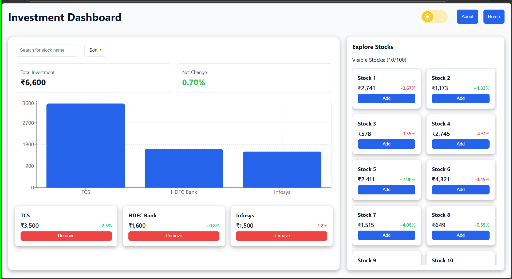
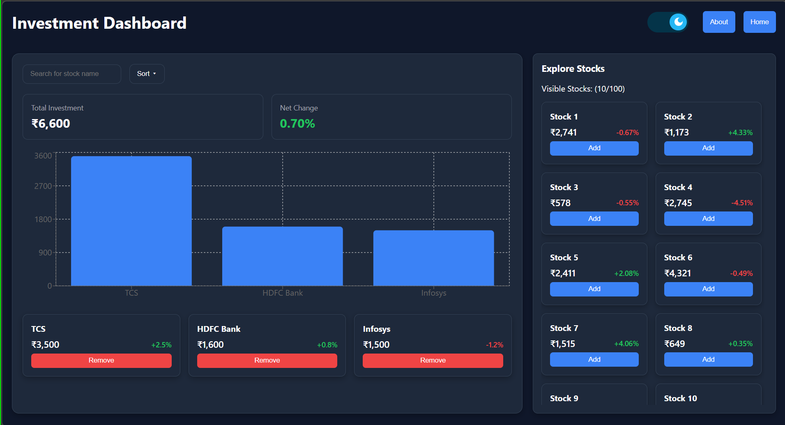
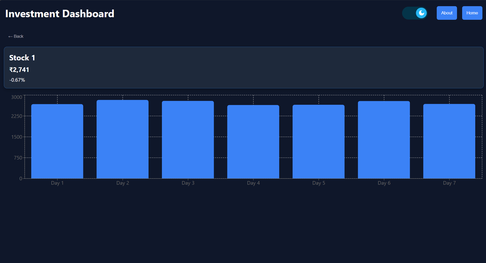
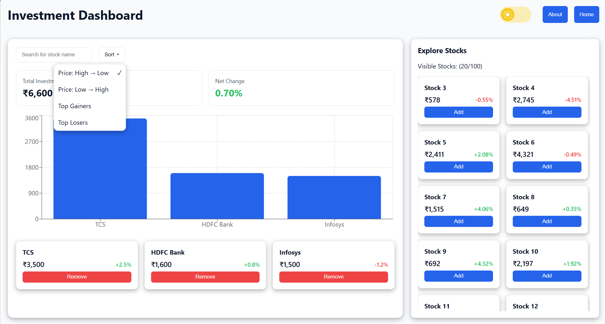
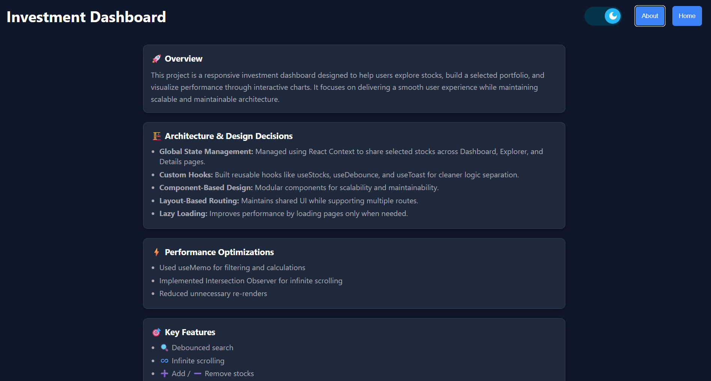

# 📊 Investment Dashboard

## 🚀 Overview
This project is a responsive investment dashboard designed to help users explore stocks, build a selected portfolio, and visualize performance through interactive charts. It focuses on delivering a smooth user experience while maintaining scalable and maintainable architecture.

## 🚀 Live Demo
https://prajaktaparit21.github.io/investment-dashboard-react/#/

## 🏗️ Architecture & Design Decisions
Global State Management: Managed using React Context to share selected stocks across Dashboard, Explorer, and Details pages.
Custom Hooks: Built reusable hooks like useStocks, useDebounce, and useToast for cleaner logic separation.
Component-Based Design: Modular components for scalability and maintainability.
Layout-Based Routing: Maintains shared UI while supporting multiple routes.
Lazy Loading: Improves performance by loading pages only when needed.

## 🎯 Key Features
🔍 Debounced search
♾️ Infinite scrolling
➕ Add / ➖ Remove stocks
📊 Chart visualization
🔔 Toast notifications
🌗 Light / Dark mode
🔄 Retry on API failure

## ⚡Performance Optimizations
Used useMemo for filtering and calculations
Implemented Intersection Observer for infinite scrolling
Reduced unnecessary re-renders

## 🛠️ Tech Stack
- React + Vite
- JavaScript (ES6+)
- CSS Modules
- React Router
 
## 🔮 Future Enhancements
Real-time stock API integration
Persistent portfolio
Advanced charts
User authentication

## ScreenShots






## ⚙️ Installation
```bash
npm install
npm start